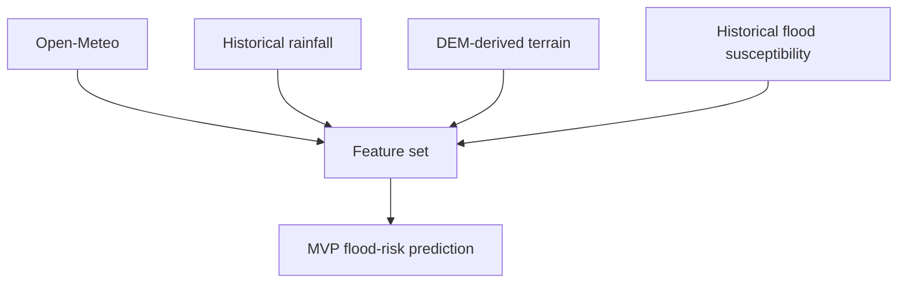
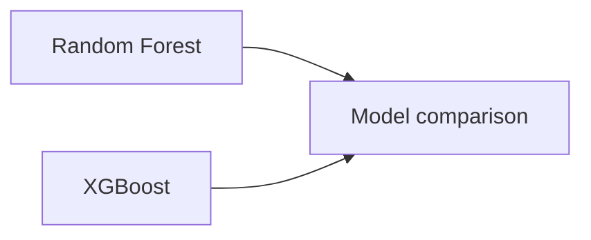
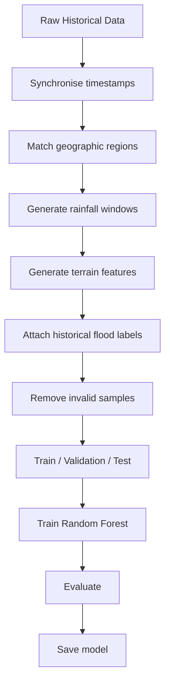
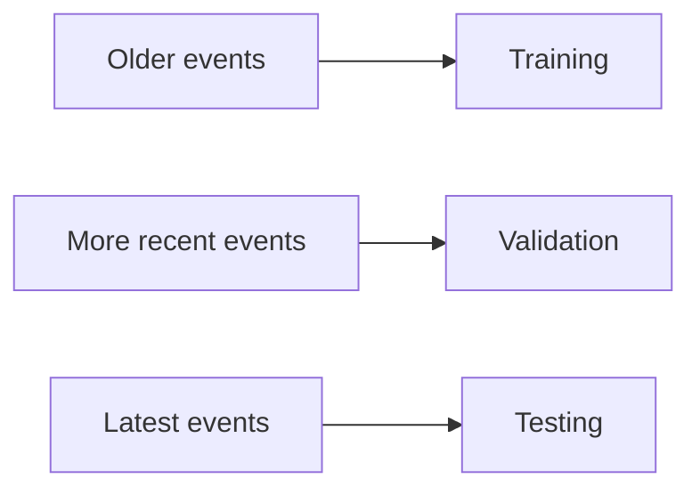
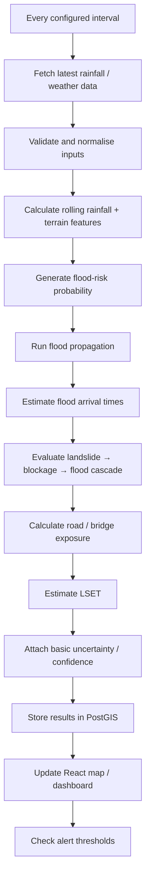
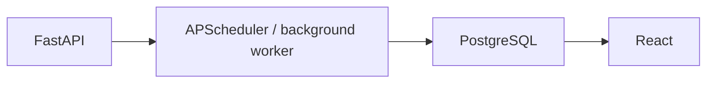
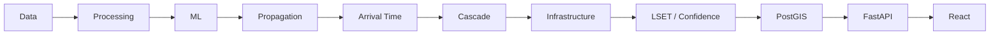
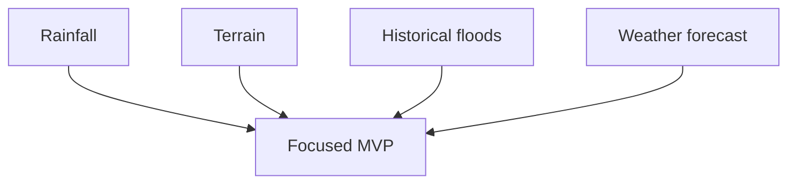
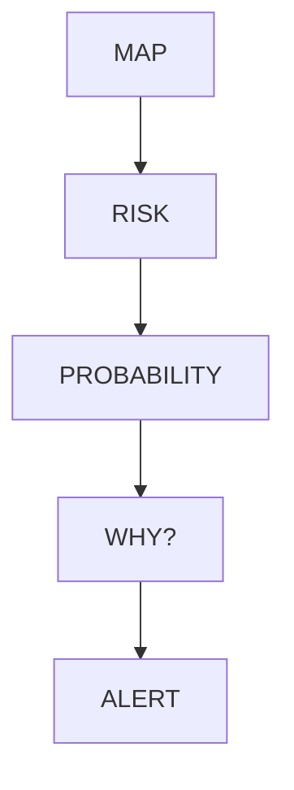

# Flash Flood Prediction System for Hilly Regions Using Multi-Source Data

## Contents

1. [Problem Understanding](#1-problem-understanding)
2. [Proposed Solution](#2-proposed-solution)
3. [Innovation & Unique Selling Points](#3-innovation--unique-selling-points)
4. [Multi-Source Data Strategy](#4-multi-source-data-strategy)
5. [System Architecture](#5-system-architecture)
6. [AI/ML Approach](#6-aiml-approach)
7. [Prediction & Risk Classification](#7-prediction--risk-classification)
8. [Real-Time Monitoring](#8-real-time-monitoring)
9. [User Interface](#9-user-interface)
10. [Backend API Design](#10-backend-api-design)
11. [Database Design](#11-database-design)
12. [Technology Stack](#12-technology-stack)
13. [Project Folder Structure](#13-project-folder-structure)
14. [Hackathon Execution Plan](#14-hackathon-execution-plan)
15. [Demo Strategy](#15-demo-strategy)
16. [What Judges Should See](#16-what-judges-should-see)
17. [Common Mistakes to Avoid](#17-common-mistakes-to-avoid)
18. [Expected Final Prototype](#18-expected-final-prototype)
19. [Recommended Final Architecture](#19-recommended-final-architecture)
20. [Final Recommendation](#20-final-recommendation)
21. [Visual Documentation Guidance](#21-visual-documentation-guidance)
22. [Reference Links](#22-reference-links)

> **Hackathon Project Planning Document** **Target audience:** 3rd-year
> engineering students **Primary objective:** Build a practical,
> explainable, near-real-time flash-flood risk prediction prototype for
> hilly regions using multiple environmental and geospatial data
> sources.
## 1. Problem Understanding

### 1.1 Simple Explanation

Flash floods in hilly regions can develop very quickly because steep
slopes, intense rainfall, narrow valleys, saturated soil and rapidly
rising streams can cause water levels to increase within a short period.

The main problem is that relying on a single parameter such as rainfall
is often insufficient.

For example:

-   50 mm of rainfall on flat, dry terrain may not immediately cause
    severe flooding.
-   The same rainfall over a steep, already-saturated catchment with a
    swollen river can create a much more dangerous situation.

The proposed system therefore combines multiple sources of information
to estimate the **current and near-future flood risk of a geographical
region**.

The system should answer:

> **"Given the current environmental conditions, how likely is this area
> to experience dangerous flooding in the next few hours?"**

It should then display the result on a map and generate an alert when
the risk becomes sufficiently high.

### 1.2 Technical Interpretation

The project is essentially a **spatiotemporal risk prediction problem**.

The system combines:

-   Meteorological observations
-   Rainfall history and forecasts
-   Hydrological observations
-   Terrain characteristics
-   Soil/environmental information
-   Historical flood events
-   Satellite-derived information

to generate a prediction such as:

``` text
Location: Kedarnath Region
Flood Probability: 78%
Risk: HIGH
Confidence: 84%

Main contributing factors:
✓ High rainfall accumulation
✓ Rapid rainfall increase
✓ Steep terrain
✓ High recent runoff potential
✓ Historical flood susceptibility
```

The system should be presented as a **decision-support and early-warning
prototype**, not as an authoritative replacement for government warning
systems.

### 1.3 Who Is Affected?

| Stakeholder | Potential benefit |
|---|---|
| Local residents | Earlier awareness |
| Tourists | Safer travel decisions |
| District authorities | Situational awareness |
| Disaster-response teams | Better prioritisation |
| Police/emergency services | Faster response planning |
| Road authorities | Identification of risky routes |
| Hydrological researchers | Multi-source analysis |
| Local administrations | Risk-based planning |

### 1.4 Major Challenges

1.  Flash floods develop rapidly.
2.  Mountain terrain is highly heterogeneous.
3.  Rainfall can vary significantly over short distances.
4.  Ground sensors may be sparse.
5.  Historical flood events are relatively rare compared with normal
    conditions.
6.  Different datasets have different spatial and temporal resolutions.
7.  Cloud cover can affect optical satellite imagery.
8.  Weather forecasts contain uncertainty.
9.  Missing sensor/API data can occur.
10. False alarms can reduce trust in an alerting system.

### 1.5 What Happens If the Problem Is Not Addressed?

Potential consequences include:

-   Loss of life
-   Damage to roads and bridges
-   Destruction of homes and infrastructure
-   Tourism disruption
-   Delayed evacuation
-   Isolation of communities
-   Difficulty prioritising emergency response
---
# 2. Proposed Solution

## 2.1 Solution Overview

Build a web-based **Flash Flood Risk Intelligence System**.

The system will:

1.  Identify a target geographical region.
2.  Collect weather and rainfall information.
3.  Incorporate terrain and historical flood susceptibility.
4.  Collect available river/water-level information.
5.  Calculate engineered environmental features.
6.  Pass those features through an ML model.
7.  Generate a flood-risk probability.
8.  Convert probability into a risk category.
9.  Display the result on an interactive map.
10. Explain the major factors contributing to the prediction.
11. Generate alerts when risk crosses predefined thresholds.

### 2.2 Basic Workflow

## 2.3 Refactored Core Features

The refactored prototype is intentionally limited to the following eight capabilities:

1. **Terrain-aware flood prediction**
2. **Flood propagation**
3. **Flood arrival-time prediction**
4. **Basic landslide → blockage → flood cascade**
5. **Road/bridge infrastructure risk**
6. **Dynamic evacuation routing (future scope)**
7. **Estimated Last Safe Departure (LSET)**
8. **Basic uncertainty/confidence**

The implementation priority is to make the first five capabilities functional in the prototype, while keeping dynamic evacuation routing explicitly marked as future scope. LSET and basic uncertainty/confidence should be implemented only to the level supported by the available data and validation.

## 2.4 Feature Implementation Priority

### Prototype / Demonstration Scope

- Terrain-aware flood prediction
- Flood propagation
- Flood arrival-time prediction
- Basic landslide → blockage → flood cascade
- Road/bridge infrastructure risk
- Estimated Last Safe Departure (LSET)
- Basic uncertainty/confidence

### Future Scope

- Dynamic evacuation routing

Dynamic evacuation routing remains outside the core implementation for the current hackathon build. The architecture should nevertheless expose the map, road-network, risk-grid, and time-dependent outputs required to add routing later.

## 2.5 Deferred Features

The following are intentionally deferred and should not be presented as implemented:

- IoT water-level sensor networks
- SMS/WhatsApp/Telegram integrations
- Dedicated mobile application
- Edge computing
- Full hydrological simulation
- Graph neural networks
- Digital-twin watershed simulation
- Automated satellite flood segmentation
---
# 3. Innovation & Unique Selling Points

The goal should not be to use the most complicated technology.

The strongest hackathon innovation is:

> **Combining heterogeneous environmental information into an
> explainable, location-specific risk score.**
---
  Innovation           What it does                       Difficulty Hackathon?
  -------------------- ------------------------------- ------------- -------------
  Multi-source risk    Combines rainfall, terrain and         Medium **Yes**
  score                historical risk

  Explainable          Shows why risk increased                  Low **Yes**
  prediction

  Dynamic risk map     Displays risk spatially                Medium **Yes**

  Rainfall             Tracks 1h/3h/6h/24h rainfall              Low **Yes**
  accumulation
  analysis

  Historical-event     Compares current conditions            Medium Recommended
  similarity           with past events

  River-level          Adds hydrological confirmation    Medium/High If data
  integration                                                        available

  Satellite            Confirms observed inundation             High Optional
  verification

  IoT sensor network   Real-time local sensors                  High Future

  LSTM/Transformer     Deep temporal modelling                  High Future
---
### Recommended differentiator: "Why Is This Area at Risk?"

Instead of displaying only:

``` text
HIGH RISK
```

display:

``` text
HIGH RISK — 81%

Primary factors:
1. 6-hour rainfall accumulation: HIGH
2. Rainfall intensity: HIGH
3. Terrain slope: HIGH
4. Recent rainfall saturation indicator: MEDIUM
5. Historical flood susceptibility: HIGH
```

This improves transparency and makes the ML system easier for judges to
understand.
---
# 4. Multi-Source Data Strategy

## 4.1 Recommended Data Sources

### A. Rainfall — ISRO GSMaP_ISRO

ISRO's MOSDAC provides GSMaP_ISRO rainfall data specifically focused on
the Indian subcontinent. The product provides approximately **0.1° ×
0.1° spatial resolution and hourly temporal resolution**, with data
extending from March 2000 onward. It is gauge-adjusted using Indian
rainfall information. ([Mosdac](https://www.mosdac.gov.in/))

**Use for:**

-   Historical rainfall
-   Rainfall accumulation
-   Rainfall intensity
-   Training data
-   Regional rainfall patterns

**Format:** HDF5

**Best use:** Training and historical analysis.
---
### B. NASA GPM IMERG

NASA's GPM IMERG provides precipitation estimates at approximately
**0.1° × 0.1° resolution** and includes half-hourly products.
([Earthdata Search](https://search.earthdata.nasa.gov/))

**Use for:**

-   Historical precipitation
-   Near-real-time precipitation
-   Cross-checking rainfall sources
-   Training data

**Format:** Satellite-derived gridded data

**Best use:** Historical training and rainfall feature generation.
---
### C. Weather Forecast --- Open-Meteo

Open-Meteo provides an hourly forecast API based on geographical
coordinates. Its documentation describes hourly weather forecasts and
variables including precipitation. ([Open
Meteo](https://open-meteo.com/))

**Possible variables:**

-   Temperature
-   Precipitation
-   Rain
-   Relative humidity
-   Wind
-   Weather condition
-   Forecast precipitation

**Format:** JSON

**Best use:** Hackathon MVP because JSON API integration is
straightforward.

**Important:** Verify current usage limits and licensing before
production deployment.
---
### D. ISRO/MOSDAC Weather and AWS

MOSDAC provides weather-related services and an Automatic Weather
Station interface containing station observations/time series.
([Mosdac](https://www.mosdac.gov.in/))

**Use for:**

-   Ground weather observations
-   Rainfall validation
-   Temperature
-   Weather station information

**Potential issue:** Access and API availability may require additional
investigation.
---
### E. Digital Elevation Model

Copernicus DEM provides global DEM products, including a 30 m public
product where available and 90 m coverage. ([Copernicus Data Space
Documentation](https://dataspace.copernicus.eu/))

**Use for calculating:**

-   Elevation
-   Slope
-   Aspect
-   Terrain ruggedness
-   Drainage-related features

**Important 2026 note:** Access conditions for some Copernicus DEM
services changed in July 2026, so access should be verified before
relying on a particular service. ([Copernicus Data Space
Ecosystem](https://dataspace.copernicus.eu/))
---
### F. Historical Flood Data --- NRSC/ISRO

NRSC's disaster-management resources contain historical flood inundation
maps and flood-related datasets. The Flood Affected Area Atlas of India
was created using historical satellite datasets covering approximately
1998--2022. ([NDRF](https://ndrf.gov.in/))

NRSC also provides flood hazard layers, annual flood layers and other
thematic datasets.

**Use for:**

-   Flood/non-flood labels
-   Historical flood frequency
-   Flood susceptibility
-   Model validation
-   Visual verification
---
### G. NRSC Flood and Vulnerability Products

NRSC/NDEM provides services related to:

-   Flood hazard
-   Near-real-time inundation
-   Spatial flood early warning
-   Runoff
-   Flood vulnerability
-   Gauge warning levels

([NDEM](https://ndem.nrsc.gov.in/))

This is particularly valuable for understanding how an Indian
operational system approaches the problem.
---
### H. Sentinel Satellite Data

Sentinel imagery can be used later for:

-   Flooded-area detection
-   Land-cover information
-   Water-body extraction
-   Post-event validation

NRSC has documented flood mapping using Sentinel-1 and other satellite
datasets.

**Important:** Do not make satellite segmentation the core MVP unless
the team already has remote-sensing experience.
---
## 4.2 Recommended MVP Data Combination

**Do not attempt to integrate every available dataset.**

Use:


Then optionally add:

**Optional confirmation layer:** River/water-level data.

This is sufficient for a convincing prototype.
---
# 5. System Architecture

## 5.1 Refactored Architecture

The system is organized around a geospatial data pipeline, a terrain-aware ML prediction layer, a flood propagation/arrival-time layer, a basic cascade-risk layer, and a presentation layer.

**Architecture flow:**


### Main Components

1. **Data ingestion**
   - Weather and rainfall observations/forecasts
   - DEM and terrain rasters
   - Historical flood/event labels
   - Road and bridge infrastructure data
   - Landslide-susceptibility/event data where available

2. **Geospatial processing**
   - Raster processing with Rasterio
   - Vector processing with GeoPandas
   - Terrain derivation: elevation, slope, aspect, ruggedness
   - Spatial joins and proximity calculations
   - Conversion of source data into common coordinate systems and spatial units

3. **ML prediction**
   - Python + scikit-learn
   - Random Forest as the primary model
   - XGBoost for model comparison/advanced experiments
   - Probability output used as the core flood-risk signal

4. **Flood dynamics layer**
   - Flood propagation over a simplified spatial grid / connected drainage representation
   - Estimated flood arrival time for affected cells/locations
   - No claim of full hydrodynamic simulation

5. **Cascade layer**
   - Basic landslide → blockage → flood scenario logic
   - Uses landslide/blockage indicators as risk modifiers rather than a full physical landslide model

6. **Infrastructure risk**
   - Intersects predicted flood extent/time with road and bridge geometries
   - Produces exposure/risk indicators for infrastructure

7. **Decision-support layer**
   - Estimated Last Safe Departure (LSET)
   - Basic uncertainty/confidence indicator based on available data/model support
   - Alert thresholds and explainable risk drivers

8. **Application layer**
   - FastAPI backend
   - React frontend
   - Leaflet or MapLibre interactive map
   - PostgreSQL + PostGIS for spatial storage and queries

## 5.2 Data Flow

1. APScheduler triggers periodic ingestion.
2. Raw weather/rainfall and geospatial datasets are validated.
3. Pandas + NumPy build time-windowed environmental features.
4. GeoPandas + Rasterio generate terrain and spatial features.
5. Random Forest/XGBoost generates flood probability.
6. The propagation layer estimates affected areas over time.
7. The arrival-time layer estimates when flooding may reach each monitored location.
8. Cascade logic evaluates the basic landslide → blockage → flood pathway.
9. Infrastructure analysis identifies exposed roads and bridges.
10. LSET is estimated from predicted arrival time and configured safety assumptions.
11. Basic uncertainty/confidence is attached to the prediction.
12. Results are stored in PostgreSQL/PostGIS.
13. FastAPI exposes predictions and geospatial layers.
14. React renders the dashboard and interactive map.

## 5.3 Design Principle

The prototype is a **decision-support and early-warning system**, not an authoritative replacement for government flood warnings. Flood propagation, arrival time, cascade behavior, LSET, and uncertainty are estimates and must be presented with appropriate caveats.
---
# 6. AI/ML Approach

## 6.1 Model Comparison
---
  Model                   Accuracy   Explainability          Data   Complexity Recommendation
                         potential                    requirement
  -------------- ----------------- ---------------- ------------- ------------ ----------------
  Logistic                  Medium        Excellent           Low          Low Baseline
  Regression

  Decision Tree             Medium        Excellent           Low          Low Baseline

  Random Forest               High             Good        Medium       Medium **MVP**

  XGBoost                     High             Good        Medium       Medium **Best advanced
                                                                               option**

  LightGBM                    High             Good        Medium       Medium Advanced

  LSTM            Potentially high              Low          High         High Future

  GRU             Potentially high              Low          High         High Future

  Transformer     Potentially high              Low     Very high    Very high Avoid

  Hydrological     Domain-specific             High          High         High Future
  model
---
## 6.2 Recommended MVP Model

### Random Forest

Use **Random Forest Classifier** as the primary MVP model.

Why:

-   Works well with tabular data.
-   Handles nonlinear relationships.
-   Requires less data engineering than deep learning.
-   Can handle mixed feature scales.
-   Relatively easy to train.
-   Feature importance can be visualised.
-   Fast enough for a hackathon.

### Advanced Model

Use **XGBoost** as the next improvement.

Compare:



and report the results honestly.

Do not claim XGBoost is better until it has actually been evaluated.
---
## 6.3 Input Features

### Environmental / Weather Features

- rain_1h
- rain_3h
- rain_6h
- rain_12h
- rain_24h
- rain_72h
- forecast_rain_3h
- forecast_rain_6h
- rainfall_intensity
- rainfall_acceleration
- temperature
- humidity

### Terrain Features

- elevation
- slope
- aspect
- terrain_ruggedness
- drainage-related indicators
- distance_to_waterbody

### Flood History Features

- historical_flood_frequency
- historical_event_severity
- historical_flood_susceptibility

### Cascade / Infrastructure Features

- landslide_susceptibility
- blockage_indicator
- distance_to_road
- road_exposure_indicator
- bridge_exposure_indicator

The ML model should remain focused on predicting flood risk. Propagation, arrival time, infrastructure exposure, LSET, and uncertainty are handled by downstream components so that each responsibility remains testable.

## 6.4 Target

A simple target:

``` text
0 = No significant flood event
1 = Flood event
```

For a multi-class system:

``` text
0 = Low
1 = Medium
2 = High
3 = Critical
```

For the MVP, binary classification internally is easier.

The risk engine can convert the probability into user-facing categories.
---
## 6.5 Training Process


---
## 6.6 Validation Strategy

Avoid random row-wise splitting if observations from the same event
appear in both training and testing.

Prefer:



This better approximates real-world deployment.
---
## 6.7 Evaluation Metrics

Do not report only accuracy.

Use:

-   Precision
-   Recall
-   F1-score
-   ROC-AUC
-   PR-AUC
-   Confusion matrix

For disaster prediction, **recall for dangerous flood events is
particularly important**, but increasing recall may increase false
alarms.
---
# 7. Prediction & Risk Classification

## 7.1 Risk Categories

A simple prototype:

| Probability | Risk |
|---:|---|
| 0–25% | LOW |
| 25–50% | MEDIUM |
| 50–75% | HIGH |
| 75–100% | CRITICAL |

These thresholds are **prototype thresholds**, not official
flood-warning thresholds.

They should be calibrated using validation data.

## 7.2 Better Risk Logic

The system can use:

``` text
Final Risk
=
ML Probability
+
Rainfall Thresholds
+
Terrain Vulnerability
+
Hydrological Signal
+
Data Quality
```

Example:

``` text
ML probability: 72%
Rainfall intensity: HIGH
6-hour accumulation: HIGH
Slope: HIGH
River rise: MEDIUM

Final risk: HIGH
```

## 7.3 Basic Uncertainty / Confidence

The system should provide a **basic confidence indicator**, not a fabricated statistical confidence interval.

It may combine:

- Input-data completeness
- Recency of observations
- Similarity to training conditions
- Model probability calibration
- Agreement between available model signals

Example presentation:

```text
Flood risk: HIGH
Probability: 78%
Data/model confidence: MEDIUM
```

The UI must clearly distinguish **prediction probability** from **confidence in the prediction**.

## 7.4 Explainability

Use:

-   Feature importance
-   SHAP values for XGBoost/advanced models
-   Rule-based explanations

Example:

``` text
Why HIGH?

+ Heavy rainfall during previous 6 hours
+ High rainfall forecast
+ Steep terrain
+ Historically flood-prone catchment
```
---
## 7.5 Flood Propagation

The propagation module converts a point/area flood-risk prediction into a time-evolving spatial representation.

For the prototype:

- Use a simplified raster/grid or connected drainage representation.
- Start propagation from high-risk upstream cells/areas.
- Apply terrain, drainage connectivity, and configurable propagation speed assumptions.
- Store predicted affected cells with time steps.
- Visualise the changing flood footprint on the map.

This is a **simplified propagation model**, not a full hydrodynamic solver.

## 7.6 Flood Arrival-Time Prediction

For each monitored location or grid cell, estimate:

- Predicted flood arrival time
- Time remaining until estimated arrival
- Arrival-time confidence/quality indicator

The arrival-time output feeds the infrastructure-risk and LSET modules.

## 7.7 Basic Landslide → Blockage → Flood Cascade

The cascade module represents a simplified chain:

**High rainfall / terrain conditions → Landslide susceptibility → Possible blockage → Increased downstream flood risk**

Implementation should use available landslide susceptibility/event information and rule-based thresholds. The prototype should clearly label this as a basic scenario model rather than a physically complete landslide simulation.

## 7.8 Road / Bridge Infrastructure Risk

Road and bridge geometries are stored in PostGIS and intersected with predicted flood extent and arrival-time layers.

For each exposed asset, calculate:

- Asset type
- Location
- Flood-risk level
- Estimated arrival time
- Exposure duration, where available
- Basic priority category

The output is intended for situational awareness and prioritisation, not structural safety certification.

## 7.9 Estimated Last Safe Departure (LSET)

LSET is derived from the estimated flood arrival time:

**LSET = Estimated Flood Arrival Time − Configured Safety / Travel Buffer**

The dashboard should show:

- Estimated arrival time
- Estimated LSET
- Buffer assumption
- Data/model confidence

LSET must be presented as a planning estimate and **not as a guarantee of safety**. Dynamic evacuation routing is future scope.

# 8. Real-Time Monitoring

## 8.1 Near-Real-Time Workflow



## 8.2 Recommended Technology

For a student hackathon:



A full Kafka/Redis streaming architecture is unnecessary for the MVP.
---
# 9. User Interface

## 9.1 Main Dashboard

The first screen should contain:

## 9.2 Map Layers

Recommended layers:

-   Risk heatmap
-   Rainfall intensity
-   Elevation
-   Rivers
-   Flood-prone areas
-   Weather stations
-   Monitored locations
-   Historical flood events

## 9.3 Location Details Panel

When a user clicks a location:

``` text
Location: Kedarnath

Current Conditions
------------------
Rainfall: 18 mm/hr
6-hour rainfall: 72 mm
24-hour rainfall: 118 mm
Temperature: 14°C
Humidity: 91%

Terrain
-------
Elevation: 3,500 m
Slope: 31°
Terrain Risk: HIGH

Flood Prediction
-----------------
Probability: 81%
Risk: HIGH

Main Drivers
------------
1. Heavy recent rainfall
2. High terrain slope
3. High historical flood susceptibility
4. Increasing rainfall trend
```
---
# 10. Backend API Design

## 10.1 Core Endpoints

### Get current risk

``` http
GET /api/risk?lat=30.735&lon=79.066
```

Response:

``` json
{
  "location": {
    "lat": 30.735,
    "lon": 79.066
  },
  "risk_probability": 0.81,
  "risk_level": "HIGH",
  "data_confidence": "HIGH",
  "drivers": [
    "high_6h_rainfall",
    "steep_slope",
    "high_historical_flood_frequency"
  ],
  "updated_at": "2026-08-25T12:00:00Z"
}
```

### Historical rainfall

``` http
GET /api/rainfall/history?lat=30.735&lon=79.066
```

### Forecast

``` http
GET /api/weather/forecast?lat=30.735&lon=79.066
```

### Map risk

``` http
GET /api/risk-map
```

### Historical flood events

``` http
GET /api/flood-events
```
---
# 11. Database Design

Recommended database:

**PostgreSQL + PostGIS**

### Tables

#### locations

``` text
id
name
latitude
longitude
elevation
slope
geometry
```

#### weather_observations

``` text
id
location_id
timestamp
rainfall
temperature
humidity
wind_speed
```

#### rainfall_features

``` text
location_id
timestamp
rain_1h
rain_3h
rain_6h
rain_12h
rain_24h
rain_72h
```

#### flood_events

``` text
id
event_date
location
severity
geometry
source
```

#### predictions

``` text
id
location_id
timestamp
probability
risk_level
data_confidence
```
---
# 12. Technology Stack

| Layer | Technology |
|---|---|
| Frontend | React |
| Backend | FastAPI |
| ML | Python + scikit-learn / Random Forest / XGBoost |
| Database | PostgreSQL + PostGIS |
| Data processing | Pandas + NumPy |
| Geospatial | GeoPandas + Rasterio |
| Scheduling | APScheduler |
| Maps | Leaflet or MapLibre |
| Deployment | Docker |
| Version control | Git + GitHub |

The stack is intentionally lightweight and suitable for a student hackathon. It avoids unnecessary distributed infrastructure while still supporting geospatial storage, scheduled updates, ML inference, and an interactive map.
---
# 13. Project Folder Structure

```text
flash-flood-system/
│
├── backend/
│   ├── main.py
│   ├── api/
│   ├── services/
│   │   ├── ingestion/
│   │   ├── prediction/
│   │   ├── propagation/
│   │   ├── arrival_time/
│   │   ├── cascade/
│   │   ├── infrastructure/
│   │   └── lset/
│   ├── database/
│   └── utils/
│
├── ml/
│   ├── data/
│   ├── preprocessing/
│   ├── features/
│   ├── training/
│   ├── evaluation/
│   └── saved_models/
│
├── geospatial/
│   ├── terrain/
│   ├── flood_grid/
│   ├── infrastructure/
│   └── preprocessing/
│
├── frontend/
│   └── src/
│       ├── components/
│       ├── pages/
│       ├── maps/
│       └── services/
│
├── data/
│   ├── rainfall/
│   ├── weather/
│   ├── dem/
│   ├── flood_events/
│   ├── landslides/
│   ├── roads/
│   ├── bridges/
│   └── processed/
│
├── notebooks/
├── docker/
├── docs/
├── requirements.txt
├── docker-compose.yml
├── .gitignore
└── README.md
```
---
# 14. Hackathon Execution Plan

## Phase 1 — Problem & Scope Setup

- Select one pilot hilly region.
- Define the flood-event target and spatial unit.
- Define the eight refactored features and implementation boundaries.
- Identify rainfall, weather, DEM, flood-history, landslide, road, and bridge datasets.
- Create the GitHub repository.
- Define FastAPI endpoints and PostGIS schema.
- Design the React dashboard and map layers.

**Output:** Working project skeleton and agreed feature scope.

## Phase 2 — Data Pipeline & Geospatial Preparation

- Ingest rainfall/weather data.
- Prepare historical flood labels.
- Process DEM with Rasterio.
- Generate terrain features with GeoPandas/Rasterio.
- Prepare roads and bridges.
- Prepare landslide-susceptibility/event indicators.
- Standardise coordinates and timestamps.

**Output:** Clean, spatially aligned feature dataset.

## Phase 3 — ML Prediction

- Build rainfall accumulation windows.
- Build terrain and historical-risk features.
- Train a baseline model.
- Train Random Forest.
- Compare with XGBoost if time permits.
- Evaluate using precision, recall, F1, ROC-AUC and PR-AUC.
- Save the selected model.

**Output:** Validated flood-risk prediction model.

## Phase 4 — Flood Dynamics & Risk Modules

- Implement simplified flood propagation.
- Implement flood arrival-time estimation.
- Implement basic landslide → blockage → flood cascade.
- Implement road/bridge exposure analysis.
- Implement LSET estimation.
- Implement basic uncertainty/confidence.

**Output:** Time-aware geospatial risk results.

## Phase 5 — Backend

- Build FastAPI application.
- Add prediction and map endpoints.
- Connect ML model.
- Connect PostgreSQL/PostGIS.
- Add APScheduler jobs.
- Add alert-threshold logic.

**Output:** Working prediction and geospatial API.

## Phase 6 — Frontend

- Build React dashboard.
- Add interactive Leaflet/MapLibre map.
- Add risk layers and time slider.
- Add location details.
- Add propagation/arrival-time visualisation.
- Add infrastructure-risk layer.
- Add LSET and confidence panels.
- Add explainability panel.

**Output:** Working decision-support dashboard.

## Phase 7 — Integration & Testing

Connect the complete pipeline:



Test:

- Missing data
- Invalid coordinates
- Delayed updates
- High-risk scenarios
- Infrastructure intersections
- Propagation time steps
- API failures
- Model edge cases

## Phase 8 — Demo Preparation

Prepare both live and simulation modes so the demonstration does not depend entirely on external APIs.
---
# 15. Demo Strategy

A strong demo should show the system changing over time rather than only displaying a static risk score.

## Demo Scenario

1. Start with normal rainfall.
2. Increase rainfall intensity and accumulation.
3. Flood probability rises.
4. High-risk cells begin propagation.
5. Downstream locations receive estimated arrival times.
6. A landslide-susceptible area triggers the basic blockage scenario.
7. Roads/bridges intersecting the predicted flood footprint are highlighted.
8. LSET is recalculated from arrival time.
9. Confidence changes if data quality is intentionally degraded.
10. The dashboard generates an early-warning alert.

## Recommended Dashboard Sequence


Use real data where reliable; otherwise use a clearly labelled historical replay or controlled simulation.
---
# 16. What Judges Should See

Within the first 60–90 seconds:

### Step 1 — Open the Dashboard

Show the selected hilly region on the interactive map.

### Step 2 — Select a Location

Display current environmental conditions and the terrain-aware flood prediction.

### Step 3 — Show the Risk Result

Example presentation:

```text
Flood Risk: HIGH
Probability: 81%
Confidence: MEDIUM
```

### Step 4 — Show Why

Display the leading drivers:

- High recent rainfall accumulation
- High rainfall intensity
- Steep terrain
- High historical flood susceptibility
- Additional cascade/infrastructure indicators where applicable

### Step 5 — Start the Time-Based Scenario

Show the predicted flood footprint propagating across the map.

### Step 6 — Show Arrival Time

Select a downstream location and display its estimated flood arrival time.

### Step 7 — Show Cascade

Demonstrate the basic:

**Landslide susceptibility → Possible blockage → Increased downstream flood risk**

### Step 8 — Show Infrastructure Risk

Highlight affected roads and bridges with their predicted risk and arrival time.

### Step 9 — Show LSET

Display:

```text
Estimated flood arrival: 18:40
Estimated LSET: 18:10
Safety buffer: 30 minutes
Confidence: MEDIUM
```

Clearly label this as an estimate, not a guarantee.

### Step 10 — Trigger the Alert

Show a concise warning with the affected area, risk level, estimated arrival time, and instruction to follow official emergency guidance.
---
# 17. Common Mistakes to Avoid

## Mistake 1 --- Using Too Many APIs

More APIs do not automatically mean better innovation.

Focus on:


---
## Mistake 2 --- Using Deep Learning Without Enough Data

Do not use LSTM/Transformer simply because it sounds impressive.

A well-evaluated Random Forest can be more convincing.
---
## Mistake 3 --- Claiming "98% Accurate"

Never claim unrealistic accuracy without proper validation.

Instead report:

``` text
F1 = 0.81
Recall = 0.87
Precision = 0.76
PR-AUC = 0.84
```

Only if those values actually come from your experiments.
---
## Mistake 4 --- Treating Probability as Reality

The model output is a prediction, not certainty.

Use:

``` text
Predicted flood risk
```

rather than:

``` text
Flood will definitely occur.
```
---
## Mistake 5 --- Ignoring False Alarms

A system that constantly says:

``` text
CRITICAL
CRITICAL
CRITICAL
```

will not be trusted.

Evaluate:

``` text
False positives
False negatives
Recall
Precision
```
---
## Mistake 6 --- Making the UI Too Complicated

Judges should understand the system within seconds.

Prioritise:


---
# 18. Expected Final Prototype

The completed prototype should provide:

- Terrain-aware flood prediction
- Time-evolving flood propagation
- Flood arrival-time prediction
- Basic landslide → blockage → flood cascade
- Road/bridge infrastructure risk
- Estimated Last Safe Departure (LSET)
- Basic uncertainty/confidence
- Interactive map and time-based visualisation
- Explainable prediction drivers
- FastAPI backend
- PostgreSQL/PostGIS persistence
- Scheduled data refresh with APScheduler
- Docker-based deployment

The user experience should answer four questions quickly:

1. **Where is the risk?**
2. **How will the flood spread and when may it arrive?**
3. **Which infrastructure is exposed?**
4. **How much decision time remains, and how reliable is the estimate?**
---
# 19. Recommended Final Architecture

```text
                 DATA SOURCES
                      │
       ┌──────────────┼───────────────┐
       │              │               │
    Rainfall       Weather           DEM
       │              │               │
       ├──────────────┼───────────────┤
       │              │               │
    Flood History   Landslides    Roads/Bridges
       │              │               │
       └──────────────┼───────────────┘
                      ▼
             INGESTION + SCHEDULING
                 APScheduler
                      │
                      ▼
       DATA PROCESSING + GEOANALYSIS
       Pandas / NumPy / GeoPandas
                Rasterio
                      │
                      ▼
              FEATURE ENGINEERING
                      │
                      ▼
        FLOOD-RISK ML PREDICTION
       Random Forest / XGBoost
                      │
          ┌───────────┼────────────┐
          ▼           ▼            ▼
     PROPAGATION   ARRIVAL      CASCADE
          │          TIME       ANALYSIS
          └───────────┼────────────┘
                      ▼
            INFRASTRUCTURE RISK
                      │
                      ▼
                LSET + CONFIDENCE
                      │
                      ▼
             PostgreSQL + PostGIS
                      │
                      ▼
                  FastAPI
                      │
                      ▼
                React Dashboard
                      │
                      ▼
             Leaflet / MapLibre
```

### Architecture Characteristics

- **Practical:** uses a manageable student-friendly stack.
- **Geospatial:** PostGIS, GeoPandas and Rasterio are first-class components.
- **Time-aware:** propagation and arrival time are explicit outputs.
- **Explainable:** ML drivers and risk modifiers are visible.
- **Modular:** propagation, cascade, infrastructure, and LSET can be tested independently.
- **Scalable:** additional data sources can be added without redesigning the whole application.
- **Demo-friendly:** simulation mode can reproduce a complete event without relying on live APIs.
---
# 20. Final Recommendation

Do not attempt to build a complete national flood-warning platform. Build a focused prototype for **one carefully selected hilly region** and make the time-aware geospatial experience the centre of the demonstration.

### Final Feature Scope

1. Terrain-aware flood prediction
2. Flood propagation
3. Flood arrival-time prediction
4. Basic landslide → blockage → flood cascade
5. Road/bridge infrastructure risk
6. Dynamic evacuation routing — **future scope**
7. Estimated Last Safe Departure (LSET)
8. Basic uncertainty/confidence

### Final Presentation Narrative

> **“We combine rainfall, terrain, historical flood information, and infrastructure data to predict location-specific flood risk, estimate how flooding may propagate and when it may arrive, identify exposed roads and bridges, provide an estimated last safe departure time, and communicate the uncertainty of the prediction through an interactive map.”**

The prototype should remain explicit about what is estimated, what is simulated, and what has been validated.
---
# 21. Visual Documentation Guidance

The documentation should use **rendered diagrams/images rather than ASCII art or text-symbol graphs**. Recommended visuals are: (1) a polished system architecture diagram, (2) a geospatial data-flow diagram, (3) a time-based flood propagation/arrival-time map sequence, and (4) a dashboard mockup. These visuals should be generated as proper diagram images with readable labels, consistent spacing, and no box-drawing characters.

---

# 22. Reference Links

The links below replace the previously empty reference section. They point to the primary or official documentation pages used by the data-source discussion.

| Resource | Official reference |
|---|---|
| ISRO / MOSDAC — GSMaP_ISRO Rain | https://mosdac.gov.in/gsmap-isro-rain |
| MOSDAC — Data Access Policy | https://www.mosdac.gov.in/data-access-policy |
| NASA Earthdata — GPM IMERG | https://gis.earthdata.nasa.gov/portal/home/item.html?id=cfa9a890b89b49d884871567844e9080 |
| Open-Meteo — Weather Forecast API | https://open-meteo.com/en/docs |
| Open-Meteo — Historical Forecast API | https://open-meteo.com/en/docs/historical-forecast-api |
| Copernicus Data Space — DEM documentation | https://documentation.dataspace.copernicus.eu/APIs/SentinelHub/Data/DEM.html |
| NRSC / ISRO — Flood Hazard Atlas | https://ndem.nrsc.gov.in/hydrological_fhz.php?lang=en |
| NRSC / ISRO — Hydrological Disaster / NDEM | https://ndem.nrsc.gov.in/hydrologicaldisasters/index.php |
| NRSC / ISRO — Flood Affected Area Atlas of India (1998–2022) | https://www.nrsc.gov.in/sites/default/files/pdf/DMSP/FloodAffectedAreaAtlas_Digital.pdf |
| NRSC / ISRO — Spatial Flood Early Warning | https://ndem.nrsc.gov.in/hydrological_sfew.php |

> **Reference maintenance note:** Verify dataset access conditions, licensing, API limits, and service availability before production use. The document is a hackathon planning guide, not an operational flood-warning specification.
